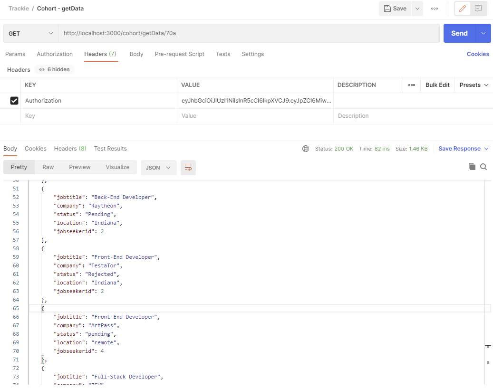

# Testing images of trackie-server

---------------------------------
### SCHOOL CONTROLLER
#### localhost:3000/school/create         -  POST 

#### localhost:3000/school/login          -  POST 

#### localhost:3000/school/countAll       -  GET 

#### localhost:3000/school/delete       -  DELETE 

---------------------------------
### COHORT CONTROLLER
#### localhost:3000/cohort/create             -  POST 

#### localhost:3000/cohort/delete             -  DELETE

#### localhost:3000/cohort/getCode/:cohort    -  GET

#### localhost:3000/cohort/getCohort          -  GET

#### localhost:3000/cohort/getData            -  GET

---------------------------------
### JOBSEEKER CONTROLLER
#### localhost:3000/jobseeker/create          -  POST

#### localhost:3000/jobseeker/login           -  POST

#### localhost:3000/jobseeker/getProfile      -  GET

#### localhost:3000/jobseeker/addCode         -  PATCH

#### localhost:3000/jobseeker/changeSharing   -  PATCH 

#### localhost:3000/jobseeker/changeEmail     -  PATCH

#### localhost:3000/jobseeker/changePwd       -  PATCH

#### localhost:3000/jobseeker/countAll        -  GET

#### localhost:3000/jobseeker/delete        -  DELETE

---------------------------------
### JOBAPPLICATION CONTROLLER
#### localhost:3000/jobapplication/create           -  POST

#### localhost:3000/jobapplication/getAll           -  GET

#### localhost:3000/jobapplication/getOne/:id       -  GET 

#### localhost:3000/jobapplication/countAll         -  GET 

#### localhost:3000/jobapplication/getData/:group   -  GET

#### localhost:3000/jobapplication/edit/:id         -  PUT

#### localhost:3000/jobapplication/delete/:id       -  DELETE

